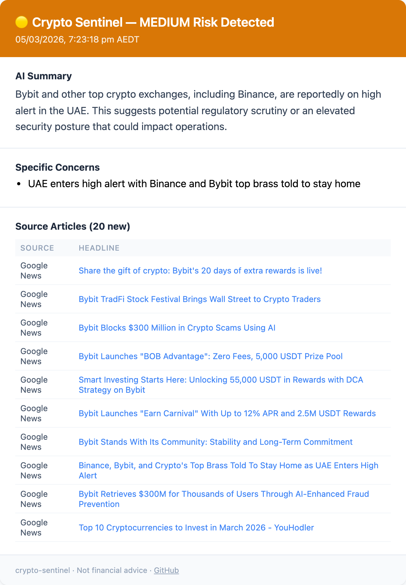

# crypto-sentinel

[](https://github.com/furic/crypto-sentinel/actions/workflows/monitor.yml)
[](https://github.com/furic/crypto-sentinel/actions/workflows/docs.yml)
[](https://www.typescriptlang.org/)
[](https://ai.google.dev/)
[](https://opensource.org/licenses/MIT)

AI-powered crypto news monitor that watches for risk signals about your chosen exchanges and coins. Runs on GitHub Actions 4x/day, analyses headlines via Gemini, and emails you only when meaningful risk is detected.

**[Documentation](https://furic.github.io/crypto-sentinel/)**

## Why

"Not your keys, not your coins" — but sometimes you have assets on exchanges anyway. Instead of reading crypto news every day hoping to catch early warning signs, this tool does it for you. There are plenty of open-source price alert projects, but none that use AI to analyse *news sentiment and risk* — insolvency rumours, hacks, regulatory actions — and alert you a few times a day so you can act fast to protect your assets.

## Email Alert Preview



## Setup

### 1. Clone and install
```bash
cd ~/Projects
git clone <your-repo-url> crypto-sentinel
cd crypto-sentinel
npm install
```

### 2. Get your API keys

| Key | Where | Cost |
|-----|-------|------|
| `GEMINI_API_KEY` | [aistudio.google.com](https://aistudio.google.com) | Free (1500 req/day) |
| `RESEND_API_KEY` | [resend.com](https://resend.com) | Free (3000 emails/month) |

### 3. Configure locally
```bash
cp .env.example .env
# Fill in your keys
```

### 4. Test locally
```bash
npm run dev
```

### 5. Deploy to GitHub Actions

Add these as **Repository Secrets** (`Settings → Secrets → Actions`):
- `GEMINI_API_KEY`
- `RESEND_API_KEY`
- `TELEGRAM_BOT_TOKEN` *(optional)* — from [@BotFather](https://t.me/BotFather)
- `TELEGRAM_CHAT_ID` *(optional)* — from [@userinfobot](https://t.me/userinfobot)

Add these as **Repository Variables** (`Settings → Variables → Actions`):
- `RECIPIENT_EMAIL` — where to receive alerts
- `WATCH_KEYWORDS` — comma-separated keywords to monitor, e.g. `binance,bybit,youhodler`

Push to GitHub — the workflow runs automatically on schedule.

## Alert thresholds

Emails are sent for `medium`, `high`, and `critical` risk levels only.  
`low` and `none` are logged but silent.

| Level | Example triggers |
|-------|-----------------|
| 🚨 critical | Insolvency, confirmed hack, withdrawal freeze |
| 🔴 high | Security breach, regulatory enforcement |
| 🟡 medium | Regulatory warning, leadership changes |
| 🟢 low | Minor negative press, market coverage |
| ⚪ none | Neutral / positive news |

## Manual trigger

Go to **Actions → Crypto Sentinel → Run workflow** in GitHub to trigger a run immediately.
